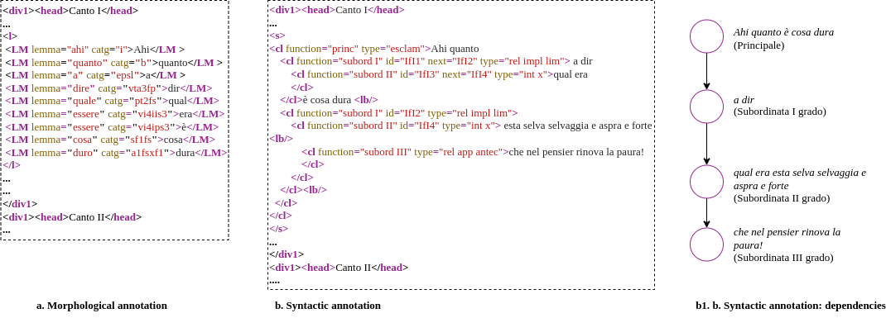

## Linking Dante: dataset and ontologies.

Linking Dante (LiDa) is a project that exemplifies the usage of OWL 2 DL in the digitization of both Dante's *Commedia* and of a consistent body of knowledge about it, including **content**, **structure**, **morphology**, **syntax** and **intertextual relationships** (in progress). The digitization has produced a Linked Open Data (LOD) dataset, which we call *Dante's Knowledge Graph* consisting of several tightly integrated RDF graphs, each being an OWL 2 DL ontology addressing a specific aspect of the *Commedia*.  
The DKG has been generated by processing the dataset at the basis of the [DanteSearch](https://dantesearch.dantenetwork.it/download.jsp) portal.  
The graph is stored in a triple-store and accessible via [SPARQL queries](https://lida.dantenetwork.it/sparql). A [Web UI](https://lida.dantenetwork.it) for browsing the poem and execute specific queries is also available.  

This repository contains the [ontologies](src/ontologies) defined and the RDF [files](src/dataset).

### The Dataset

The Knowledge Graph is structured according axioms defined in [OLiRes](src/ontologies/olires/olires-current.ttl) and has been created starting from the   Commedia dataset published by [DanteSearch](https://dantesearch.dantenetwork.it), a digital platform that allows navigating, querying and downloading source data of the complete corpus of Dante’s vernacular and Latin works. The published dataset is lemmatized and annotated to describe the morphology and syntax of texts. The DanteSearch dataset consists of a set of XML-TEI files; each file contains one type of annotation, either syntactic or morphological, for a specific text or for a section of a text.
The dataset of the *Commedia*  is composed of 4 XML-TEI files: 3 with the morphological annotation, one for every *cantica* , and one with the syntactic annotation of the whole poem. 
 
 
 

In the files with morphological annotations, TEI level-1 text division elements (`<div1>`) and verse line elements (`<l>`) are usedto annotate the text structure and each inflected form is annotated with the element `<LM>`. In these sources the morphological information is encoded
in two attributes of the `<LM>` element: @lemma and @catg, whose values are the lemma and a coding of the grammatical/morphological characteristics of the annotated inflected form. The syntactic annotation in DanteSearch is based on sentence analysis (1): text is represented as a sequence of sentences, which are divided into clauses; a sentence or a clause can be composed of non-consecutive text fragments. Sentences are delimited with the element `<s>`, and clauses with the element `<cl>`; both elements can have an identifier and the attribute @next (IDREF), used to link elements annotating non-consecutive text fragments into a single aggregation. The syntactic type and function of each clause are encoded as values of @type and @function attributes of the <cl> element annotating it. Subordinate/coordinate dependencies between clauses within a sentence are encoded both in the annotations and in the nesting of <cl> elements.

### Mapping the data

The first step in mapping the XML-TEI annotations into the RDF graph has been the creation of the triples defining the vocabulary of the *Commedia*. The
poem is written using the 14th-century Italian vocabulary, since such vocabulary isn’t available in digital form, it has been generated by parsing the morphologically annotated files and mapping inflected forms and values of @lemma attributes into a set OWL axioms based on the Lemon lexicon18 (included in OLiRes). In parallel, for every inflected form, the linguistic level triples and the occurrence level triples are generated.

#### References

1.  Gigli, S.:  La codifica sintattica della Commedia di Dante. Sintassi dell’italiano antico e sintassi di Dante. Atti del seminario di studi , a cura di D’Amico, Marta p. 81–96 (2015)
